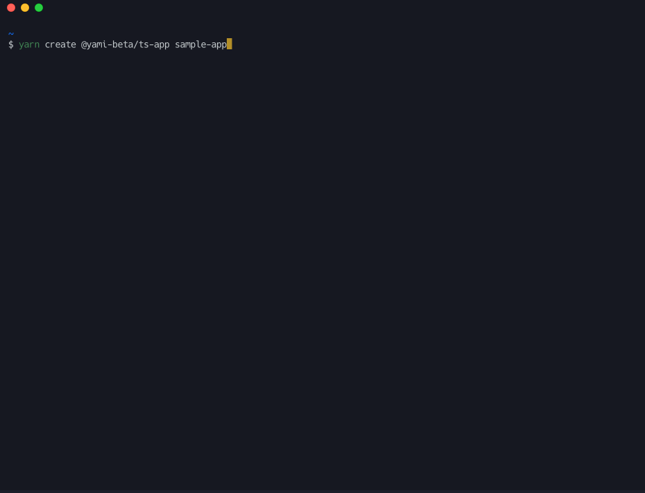

# @yami-beta/create-ts-app

My personal CLI to generate TypeScript application



## Usage

```bash
$ yarn create @yami-beta/ts-app path/to/dir
# or
$ npx @yami-beta/create-ts-app path/to/dir
```

# LICENSE

MIT

